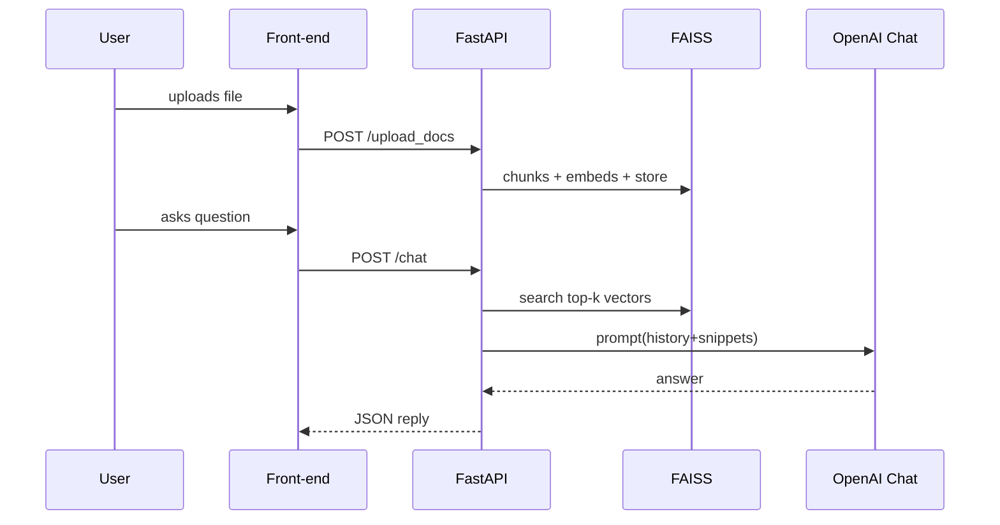

# Multi‑Agentic Conversational AI System

> **Status:** Phase‑1 prototype (MVP) complete — core backend up & running ✔️

---

## 1 ▪ What this repo does

A full‑stack FastAPI service that lets users **upload real‑estate documents** (PDF/CSV/TXT), ask natural‑language questions, and get GPT‑4‑powered answers grounded in those docs.

### Key features delivered in Phase 1

| Layer             | Highlights                                                                                             |
| ----------------- | ------------------------------------------------------------------------------------------------------ |
| **Backend**       | FastAPI + Uvicorn + SQLite ORM (SQLAlchemy 2)                                                          |
| **CRUD**          | Users, Conversations, Messages tables; tests pass                                                      |
| **File ingest**   | `/upload_docs` endpoint → splits 500‑token chunks → OpenAI Embeddings → **FAISS** vector store on disk |
| **RAG retrieval** | `search(query, k)` returns top‑k doc snippets in <200 ms                                               |
| **Chat loop**     | `/chat` builds prompt = last N turns + snippets → GPT‑4o (mini) via retry/timeout wrapper              |
| **Persistence**   | Every user/assistant message stored for history & analytics                                            |
| **Config‑first**  | System prompt lives in `config/prompt.txt` → tweak tone w/out code                                     |

---

## 2 ▪ Repo layout

```
app/
 ├─ api/          ← FastAPI routers (chat, crm, files)
 ├─ core/         ← database.py (engine + SessionLocal)
 ├─ models/       ← ORM models (User, Conversation, Message)
 ├─ services/     ← embeddings.py, history.py, crm.py …
utils/
 ├─ logger.py     ← shared logger
 └─ llm.py        ← OpenAI Chat wrapper (retry + timeout)
config/
 └─ prompt.txt    ← editable system‑prompt
data/
 ├─ uploads/      ← raw user files
 └─ vector_db/    ← faiss.index + meta.jsonl
```

---

## 3 ▪ How to run locally

```bash
# 1  Clone & create venv
python3 -m venv .venv && source .venv/bin/activate

# 2  Install deps
pip install -r requirements.txt

# 3  Set secrets
echo "OPENAI_API_KEY=sk‑…" > .env

# 4  Start the server
python -m uvicorn app.main:app --reload  # http://127.0.0.1:8000
```

### Quick demo script

```bash
# Upload a sample file
curl -F "file=@docs/sample.txt" http://127.0.0.1:8000/upload_docs

# Ask a question
curl -X POST -H "Content-Type: application/json" \
     -d '{"user_id":1,"message":"What is earnest money?"}' \
     http://127.0.0.1:8000/chat
```

---

## 4 ▪ API reference (Phase 1)

| Method & path                       | Brief                                       |
| ----------------------------------- | ------------------------------------------- |
| `POST /upload_docs`                 | multipart file upload → ingest to vector DB |
| `POST /crm/create_user`             | add user (email, name, company)             |
| `PUT  /crm/update_user/{id}`        | edit name / company                         |
| `GET  /crm/conversations/{user_id}` | list conversation IDs                       |
| `POST /chat`                        | ask a question; returns GPT‑4 answer        |

Swagger UI auto‑generated at `/docs`.

---

## 5 ▪ Behind‑the‑scenes flow



---

## 6 ▪ Roadmap / future ideas

- **Front‑end**: quick Streamlit or React + Tailwind chat UI
- **Agents**: add Mortgage‑Calculator & Property‑Finder sub‑agents
- **Auth**: bearer‑token header + role‑based scopes
- **Doc types**: auto‑OCR PDFs; parse MLS CSV into structured listings
- **Vector DB swap**: optional Chroma cloud index for scale
- **Docker**: containerise & docker‑compose for one‑shot setup

---

## 7 ▪ Contributing (partner checklist)

1. **Pull latest** → `git pull origin main`
2. **Create feature branch** → `git checkout -b feature/your‑topic`
3. **Write tests** in `tests/` (pytest)
4. **Run black & isort** → `pip install black isort` then `black . && isort .`
5. **PR & review**

---

> *Questions? Ping me on Slack or open a GitHub issue.*